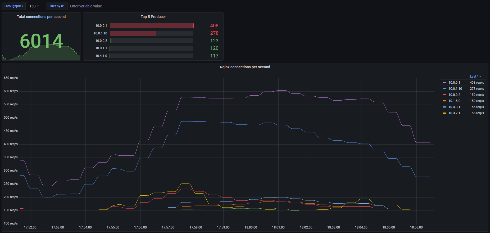

# Nginx ingress counter (exporter)
Exporter counting the number of connections in kubernetes ingress nginx

## Install
```
kubectl apply -f nginx-ingress-counter.yaml
```
## Configuration
Exporter environment variables 

| Variable         | Description                                            |
| ---------------- | ------------------------------------------------------ |
| INGRESSNAMESPACE | kubernetes namespace where ingress nginx deployed      |
| INGRESSPODNAME   | read log pods where name contains that string          |
| LOGLEVEL         | the maximum level of messages that should be logged    |

## Dashboard

